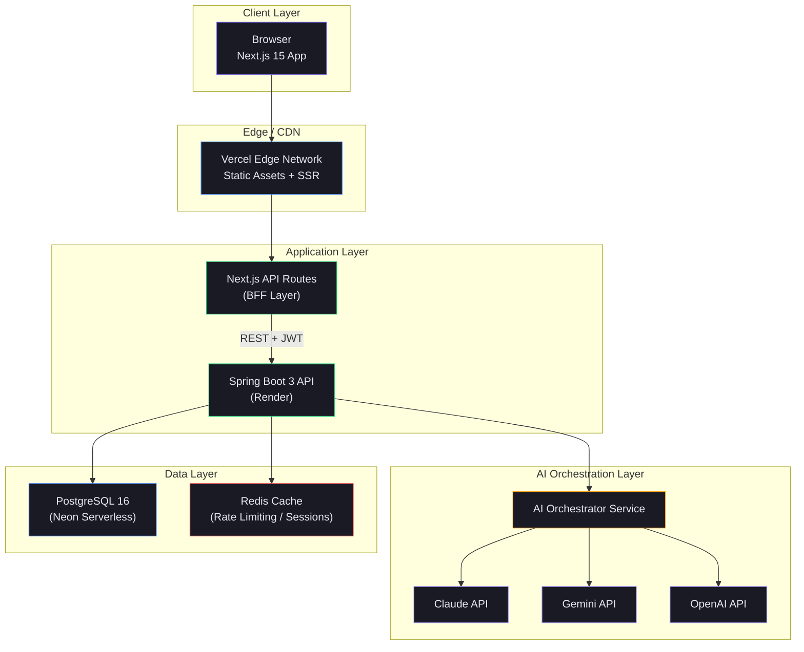
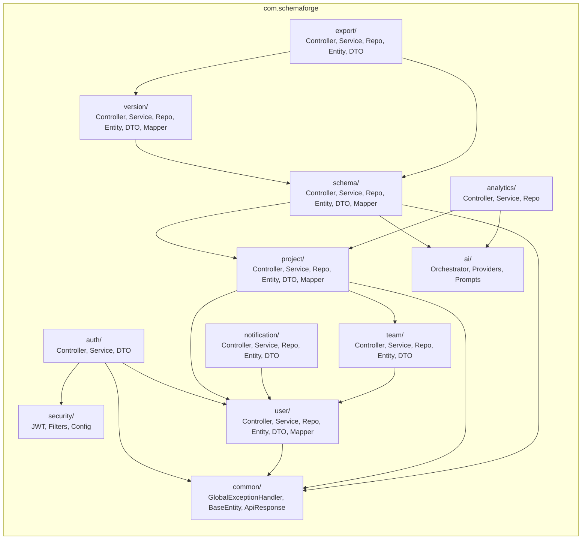
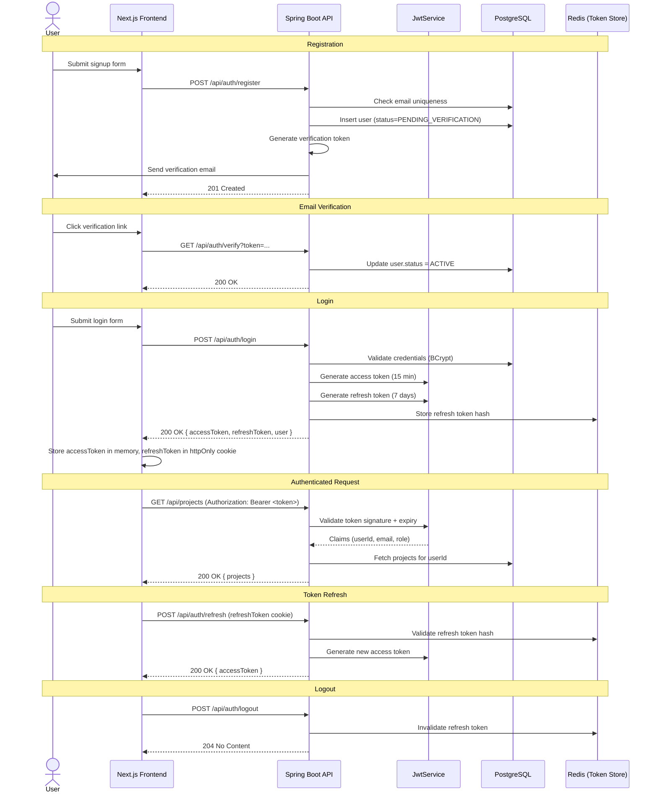
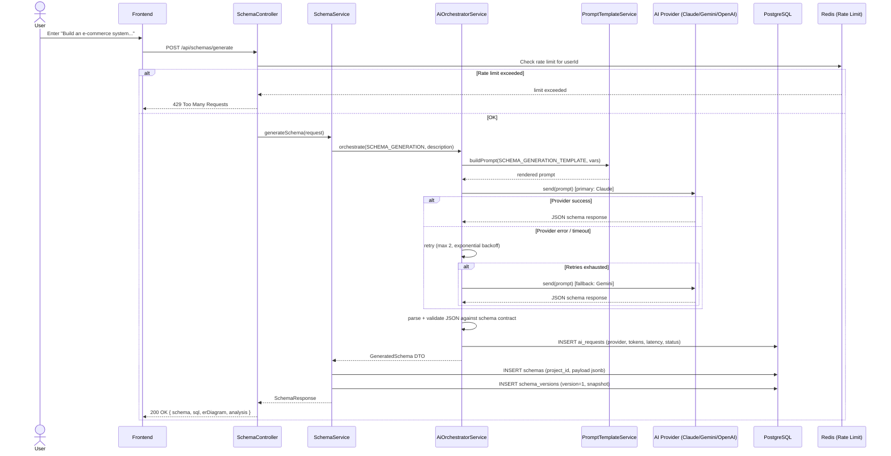
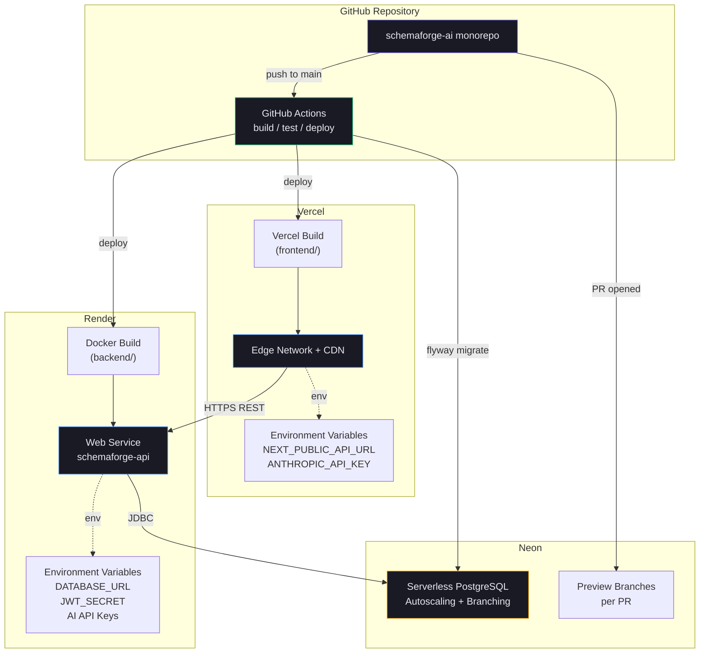

# SchemaForge AI — System Architecture

## 1. High-Level Architecture



### Component Responsibilities

| Layer | Component | Responsibility |
|---|---|---|
| Client | Next.js App | UI rendering, client state (Zustand), data fetching (React Query) |
| Edge | Vercel | Static asset hosting, SSR, edge caching, image optimization |
| Application | Next.js API Routes | Thin proxy/BFF — attaches auth headers, handles SSR data fetching |
| Application | Spring Boot API | Core business logic, auth, persistence, AI orchestration trigger |
| AI | AI Orchestrator | Provider selection, prompt templating, fallback, retry, token tracking |
| Data | PostgreSQL | Primary relational store — users, projects, schemas, versions, etc. |
| Data | Redis | Rate limiting counters, refresh token denylist, AI response cache |

---

## 2. Low-Level Architecture (Backend)

```mermaid
graph TB
    subgraph Controllers["Controller Layer"]
        AuthC["AuthController"]
        UserC["UserController"]
        ProjectC["ProjectController"]
        SchemaC["SchemaController"]
        VersionC["VersionController"]
        AiC["AiController"]
        ExportC["ExportController"]
        NotifC["NotificationController"]
        TeamC["TeamController"]
        AnalyticsC["AnalyticsController"]
    end

    subgraph Services["Service Layer"]
        AuthS["AuthService"]
        UserS["UserService"]
        ProjectS["ProjectService"]
        SchemaS["SchemaService"]
        VersionS["VersionService"]
        AiOrchestratorS["AiOrchestratorService"]
        ExportS["ExportService"]
        NotifS["NotificationService"]
        TeamS["TeamService"]
        AnalyticsS["AnalyticsService"]
    end

    subgraph Repos["Repository Layer (Spring Data JPA)"]
        UserR["UserRepository"]
        ProjectR["ProjectRepository"]
        SchemaR["SchemaRepository"]
        VersionR["SchemaVersionRepository"]
        AiR["AiRequestRepository"]
        CommentR["CommentRepository"]
        TeamR["TeamRepository"]
        InviteR["InvitationRepository"]
        ExportR["ExportRepository"]
        NotifR["NotificationRepository"]
        AuditR["AuditLogRepository"]
    end

    subgraph Security["Security Layer"]
        JwtFilter["JwtAuthenticationFilter"]
        JwtService["JwtService"]
        SecurityConfig["SecurityConfig"]
        UserDetailsS["CustomUserDetailsService"]
    end

    subgraph External["External Integrations"]
        ClaudeAPI["Claude API"]
        GeminiAPI["Gemini API"]
        OpenAIAPI["OpenAI API"]
        DB["PostgreSQL"]
    end

    AuthC --> AuthS --> UserR
    AuthC --> JwtService
    UserC --> UserS --> UserR
    ProjectC --> ProjectS --> ProjectR
    SchemaC --> SchemaS --> SchemaR
    SchemaC --> AiOrchestratorS
    VersionC --> VersionS --> VersionR
    AiC --> AiOrchestratorS --> AiR
    AiOrchestratorS --> ClaudeAPI
    AiOrchestratorS --> GeminiAPI
    AiOrchestratorS --> OpenAIAPI
    ExportC --> ExportS --> ExportR
    NotifC --> NotifS --> NotifR
    TeamC --> TeamS --> TeamR
    TeamC --> TeamS --> InviteR
    AnalyticsC --> AnalyticsS --> AuditR

    JwtFilter --> JwtService
    JwtFilter --> UserDetailsS
    SecurityConfig --> JwtFilter

    UserR --> DB
    ProjectR --> DB
    SchemaR --> DB
    VersionR --> DB
    AiR --> DB
    CommentR --> DB
    TeamR --> DB
    InviteR --> DB
    ExportR --> DB
    NotifR --> DB
    AuditR --> DB
```



---

## 3. Service Architecture (Module Map)



---

## 4. Authentication Flow



---

## 5. AI Processing Flow



---

## 6. Deployment Architecture



### 6.1 Vercel (Frontend)

- **Build**: `npm run build` from `frontend/` directory, root directory set to `frontend`
- **Output**: Next.js standalone build, deployed to Vercel Edge Network
- **Environments**: `production` (main branch), `preview` (PRs)
- **Env vars**: `NEXT_PUBLIC_API_URL`, `ANTHROPIC_API_KEY` (server-side only, used in API routes)
- **Domains**: `app.schemaforge.ai` (production), `*.vercel.app` (previews)

### 6.2 Render (Backend)

- **Build**: Docker build using `backend/Dockerfile`, multi-stage Maven build → JRE 21 runtime
- **Service type**: Web Service, auto-deploy on push to `main`
- **Health check**: `GET /actuator/health`
- **Env vars**: `DATABASE_URL`, `DATABASE_USERNAME`, `DATABASE_PASSWORD`, `JWT_SECRET`, `JWT_REFRESH_SECRET`, `ANTHROPIC_API_KEY`, `GEMINI_API_KEY`, `OPENAI_API_KEY`, `REDIS_URL`, `CORS_ALLOWED_ORIGINS`
- **Scaling**: Horizontal autoscaling 1–3 instances based on CPU

### 6.3 Neon (PostgreSQL)

- **Project**: `schemaforge-ai-prod`
- **Branching**: Each PR creates an isolated database branch for integration tests
- **Migrations**: Flyway runs automatically on backend startup (`spring.flyway.enabled=true`)
- **Connection pooling**: PgBouncer (Neon pooled connection string) used by the Spring Boot HikariCP pool

---

## 7. Folder Structure (Repository Root)

```
schemaforge-ai/
├── frontend/                              # Next.js 15 application
│   ├── src/
│   │   ├── app/
│   │   │   ├── (marketing)/
│   │   │   │   └── page.tsx               # Landing page
│   │   │   ├── (auth)/
│   │   │   │   ├── login/page.tsx
│   │   │   │   └── register/page.tsx
│   │   │   ├── (app)/
│   │   │   │   ├── dashboard/page.tsx
│   │   │   │   ├── projects/
│   │   │   │   │   ├── page.tsx
│   │   │   │   │   └── [id]/page.tsx
│   │   │   │   ├── schemas/[id]/page.tsx
│   │   │   │   ├── settings/page.tsx
│   │   │   │   └── profile/page.tsx
│   │   │   ├── api/                       # Next.js API routes (BFF)
│   │   │   ├── layout.tsx
│   │   │   └── globals.css
│   │   ├── components/
│   │   │   ├── ui/                        # shadcn/ui primitives
│   │   │   ├── layout/                    # Navbar, Sidebar, Shell
│   │   │   ├── landing/                   # Hero, FeatureCards, Pricing
│   │   │   ├── schema/                    # SchemaEditor, ERDiagramViewer, SchemaChat
│   │   │   ├── dashboard/                 # AnalyticsCards, ProjectTable
│   │   │   └── shared/
│   │   ├── lib/                           # api client, utils, constants
│   │   ├── store/                         # Zustand stores
│   │   ├── hooks/                         # custom hooks
│   │   └── types/                         # TS types
│   ├── public/
│   ├── Dockerfile
│   ├── package.json
│   ├── tsconfig.json
│   ├── tailwind.config.ts
│   └── next.config.ts
│
├── backend/                                # Spring Boot 3 application
│   ├── src/main/java/com/schemaforge/
│   │   ├── auth/                          # AuthController, AuthService, DTOs
│   │   ├── security/                      # JwtService, JwtFilter, SecurityConfig
│   │   ├── user/                          # User module (full stack)
│   │   ├── project/                       # Project module (full stack)
│   │   ├── schema/                        # Schema module (full stack)
│   │   ├── version/                       # SchemaVersion module (full stack)
│   │   ├── ai/                            # AI orchestration, providers, prompts
│   │   ├── export/                        # Export module (full stack)
│   │   ├── notification/                  # Notification module (full stack)
│   │   ├── team/                          # Team & Invitation module (full stack)
│   │   ├── analytics/                     # Analytics module
│   │   ├── common/                        # Shared base classes, exception handling
│   │   └── SchemaForgeApplication.java
│   ├── src/main/resources/
│   │   ├── application.yml
│   │   ├── application-dev.yml
│   │   ├── application-prod.yml
│   │   └── db/migration/                  # Flyway migrations (V1__*.sql ...)
│   ├── src/test/java/com/schemaforge/
│   ├── Dockerfile
│   └── pom.xml
│
├── docs/
│   ├── 01-architecture.md
│   ├── 02-database-design.md
│   ├── 03-api-documentation.md
│   └── 04-deployment-guide.md
│
├── .github/workflows/
│   ├── build.yml
│   ├── test.yml
│   └── deploy.yml
│
├── docker-compose.yml
├── .gitignore
└── README.md
```
