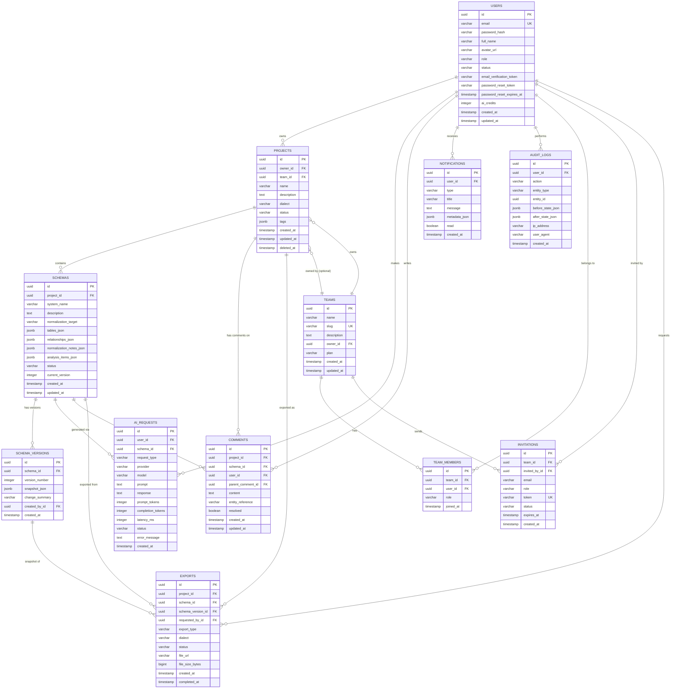

# SchemaForge AI — Database Design

## 1. Entity Relationship Diagram

---

## 2. Table Specifications

### 2.1 `users`

Core identity table. Stores authentication credentials, profile information, and AI credit balances.

| Column | Type | Constraints | Description |
|---|---|---|---|
| `id` | UUID | PK, default `gen_random_uuid()` | Unique user identifier |
| `email` | VARCHAR(255) | UNIQUE, NOT NULL | Login email |
| `password_hash` | VARCHAR(255) | NOT NULL | BCrypt hash |
| `full_name` | VARCHAR(255) | NOT NULL | Display name |
| `avatar_url` | VARCHAR(512) | NULL | Profile picture URL |
| `role` | VARCHAR(20) | NOT NULL, default `'USER'` | `USER`, `ADMIN` |
| `status` | VARCHAR(30) | NOT NULL, default `'PENDING_VERIFICATION'` | `PENDING_VERIFICATION`, `ACTIVE`, `SUSPENDED` |
| `email_verification_token` | VARCHAR(255) | NULL | One-time verification token |
| `password_reset_token` | VARCHAR(255) | NULL | One-time reset token |
| `password_reset_expires_at` | TIMESTAMPTZ | NULL | Expiry for reset token |
| `ai_credits` | INTEGER | NOT NULL, default `100` | Remaining AI generation credits |
| `created_at` | TIMESTAMPTZ | NOT NULL, default `now()` | Account creation time |
| `updated_at` | TIMESTAMPTZ | NOT NULL, default `now()` | Last update time |

**Indexes**: `idx_users_email` (unique), `idx_users_status`

---

### 2.2 `teams`

Organizations / workspaces for collaboration features.

| Column | Type | Constraints | Description |
|---|---|---|---|
| `id` | UUID | PK | Team identifier |
| `name` | VARCHAR(255) | NOT NULL | Display name |
| `slug` | VARCHAR(100) | UNIQUE, NOT NULL | URL-safe identifier |
| `description` | TEXT | NULL | Team description |
| `owner_id` | UUID | FK → `users.id`, NOT NULL | Team owner |
| `plan` | VARCHAR(20) | NOT NULL, default `'FREE'` | `FREE`, `PRO`, `TEAM` |
| `created_at` | TIMESTAMPTZ | NOT NULL, default `now()` | |
| `updated_at` | TIMESTAMPTZ | NOT NULL, default `now()` | |

**Indexes**: `idx_teams_slug` (unique), `idx_teams_owner_id`

---

### 2.3 `team_members`

Join table mapping users to teams with a role.

| Column | Type | Constraints | Description |
|---|---|---|---|
| `id` | UUID | PK | |
| `team_id` | UUID | FK → `teams.id`, NOT NULL, ON DELETE CASCADE | |
| `user_id` | UUID | FK → `users.id`, NOT NULL, ON DELETE CASCADE | |
| `role` | VARCHAR(20) | NOT NULL, default `'MEMBER'` | `OWNER`, `ADMIN`, `MEMBER`, `VIEWER` |
| `joined_at` | TIMESTAMPTZ | NOT NULL, default `now()` | |

**Indexes**: `uq_team_members_team_user` (unique on `team_id, user_id`), `idx_team_members_user_id`

---

### 2.4 `invitations`

Pending team invitations sent by email.

| Column | Type | Constraints | Description |
|---|---|---|---|
| `id` | UUID | PK | |
| `team_id` | UUID | FK → `teams.id`, NOT NULL, ON DELETE CASCADE | |
| `invited_by_id` | UUID | FK → `users.id`, NOT NULL | |
| `email` | VARCHAR(255) | NOT NULL | Invitee email |
| `role` | VARCHAR(20) | NOT NULL, default `'MEMBER'` | Role to assign on accept |
| `token` | VARCHAR(255) | UNIQUE, NOT NULL | Invitation acceptance token |
| `status` | VARCHAR(20) | NOT NULL, default `'PENDING'` | `PENDING`, `ACCEPTED`, `EXPIRED`, `REVOKED` |
| `expires_at` | TIMESTAMPTZ | NOT NULL | Expiry (7 days from creation) |
| `created_at` | TIMESTAMPTZ | NOT NULL, default `now()` | |

**Indexes**: `idx_invitations_token` (unique), `idx_invitations_team_id`, `idx_invitations_email`

---

### 2.5 `projects`

A user or team's workspace for a single database design effort. Soft-deletable.

| Column | Type | Constraints | Description |
|---|---|---|---|
| `id` | UUID | PK | |
| `owner_id` | UUID | FK → `users.id`, NOT NULL | Project creator |
| `team_id` | UUID | FK → `teams.id`, NULL | Owning team (if shared) |
| `name` | VARCHAR(255) | NOT NULL | Project name |
| `description` | TEXT | NULL | Project description |
| `dialect` | VARCHAR(20) | NOT NULL, default `'postgresql'` | `postgresql`, `mysql`, `sqlserver`, `oracle` |
| `status` | VARCHAR(20) | NOT NULL, default `'ACTIVE'` | `ACTIVE`, `ARCHIVED` |
| `tags` | JSONB | NOT NULL, default `'[]'` | Array of string tags |
| `created_at` | TIMESTAMPTZ | NOT NULL, default `now()` | |
| `updated_at` | TIMESTAMPTZ | NOT NULL, default `now()` | |
| `deleted_at` | TIMESTAMPTZ | NULL | Soft-delete marker |

**Indexes**: `idx_projects_owner_id`, `idx_projects_team_id`, `idx_projects_status`, partial index `idx_projects_not_deleted` WHERE `deleted_at IS NULL`

---

### 2.6 `schemas`

The generated database design artifact for a project. One project can have multiple schemas (e.g. iterations).

| Column | Type | Constraints | Description |
|---|---|---|---|
| `id` | UUID | PK | |
| `project_id` | UUID | FK → `projects.id`, NOT NULL, ON DELETE CASCADE | |
| `system_name` | VARCHAR(255) | NOT NULL | AI-generated system name |
| `description` | TEXT | NULL | One-line system description |
| `normalization_target` | VARCHAR(10) | NOT NULL, default `'3nf'` | `2nf`, `3nf`, `bcnf` |
| `tables_json` | JSONB | NOT NULL | Array of `SchemaTable` objects |
| `relationships_json` | JSONB | NOT NULL, default `'[]'` | Array of `SchemaRelationship` objects |
| `normalization_notes_json` | JSONB | NOT NULL, default `'[]'` | Array of `NormalizationNote` objects |
| `analysis_items_json` | JSONB | NOT NULL, default `'[]'` | Array of `AnalysisItem` objects |
| `status` | VARCHAR(20) | NOT NULL, default `'DRAFT'` | `DRAFT`, `FINAL` |
| `current_version` | INTEGER | NOT NULL, default `1` | Points to latest `schema_versions.version_number` |
| `created_at` | TIMESTAMPTZ | NOT NULL, default `now()` | |
| `updated_at` | TIMESTAMPTZ | NOT NULL, default `now()` | |

**Indexes**: `idx_schemas_project_id`, GIN index `idx_schemas_tables_json` on `tables_json`

---

### 2.7 `schema_versions`

Immutable snapshots of a schema, enabling version comparison and rollback.

| Column | Type | Constraints | Description |
|---|---|---|---|
| `id` | UUID | PK | |
| `schema_id` | UUID | FK → `schemas.id`, NOT NULL, ON DELETE CASCADE | |
| `version_number` | INTEGER | NOT NULL | Sequential version (1, 2, 3...) |
| `snapshot_json` | JSONB | NOT NULL | Full schema snapshot at this version |
| `change_summary` | VARCHAR(500) | NULL | Description of what changed |
| `created_by_id` | UUID | FK → `users.id`, NOT NULL | Who created this version |
| `created_at` | TIMESTAMPTZ | NOT NULL, default `now()` | |

**Indexes**: `uq_schema_versions_schema_version` (unique on `schema_id, version_number`), `idx_schema_versions_schema_id`

---

### 2.8 `ai_requests`

Audit trail of every AI provider call — used for token tracking, billing, debugging, and rate limiting.

| Column | Type | Constraints | Description |
|---|---|---|---|
| `id` | UUID | PK | |
| `user_id` | UUID | FK → `users.id`, NOT NULL | |
| `schema_id` | UUID | FK → `schemas.id`, NULL | Associated schema (if applicable) |
| `request_type` | VARCHAR(40) | NOT NULL | `SCHEMA_GENERATION`, `SCHEMA_REVIEW`, `NORMALIZATION_ANALYSIS`, `CHAT`, `SQL_GENERATION`, `DOCUMENTATION` |
| `provider` | VARCHAR(20) | NOT NULL | `CLAUDE`, `GEMINI`, `OPENAI` |
| `model` | VARCHAR(100) | NOT NULL | e.g. `claude-sonnet-4-20250514` |
| `prompt` | TEXT | NOT NULL | Rendered prompt sent |
| `response` | TEXT | NULL | Raw response received |
| `prompt_tokens` | INTEGER | NOT NULL, default `0` | |
| `completion_tokens` | INTEGER | NOT NULL, default `0` | |
| `latency_ms` | INTEGER | NOT NULL, default `0` | |
| `status` | VARCHAR(20) | NOT NULL | `SUCCESS`, `FAILED`, `RETRIED`, `FALLBACK` |
| `error_message` | TEXT | NULL | |
| `created_at` | TIMESTAMPTZ | NOT NULL, default `now()` | |

**Indexes**: `idx_ai_requests_user_id`, `idx_ai_requests_schema_id`, `idx_ai_requests_created_at`, `idx_ai_requests_user_created` on `(user_id, created_at)` for rate-limit queries

---

### 2.9 `comments`

Threaded comments on projects/schemas for collaboration, optionally referencing a specific table/field.

| Column | Type | Constraints | Description |
|---|---|---|---|
| `id` | UUID | PK | |
| `project_id` | UUID | FK → `projects.id`, NOT NULL, ON DELETE CASCADE | |
| `schema_id` | UUID | FK → `schemas.id`, NULL, ON DELETE CASCADE | |
| `user_id` | UUID | FK → `users.id`, NOT NULL | Comment author |
| `parent_comment_id` | UUID | FK → `comments.id`, NULL | For threaded replies |
| `content` | TEXT | NOT NULL | Comment body |
| `entity_reference` | VARCHAR(255) | NULL | e.g. `table:orders` or `field:orders.customer_id` |
| `resolved` | BOOLEAN | NOT NULL, default `false` | |
| `created_at` | TIMESTAMPTZ | NOT NULL, default `now()` | |
| `updated_at` | TIMESTAMPTZ | NOT NULL, default `now()` | |

**Indexes**: `idx_comments_project_id`, `idx_comments_schema_id`, `idx_comments_parent_comment_id`

---

### 2.10 `exports`

Records of generated export artifacts (SQL files, PDFs, PNG diagrams).

| Column | Type | Constraints | Description |
|---|---|---|---|
| `id` | UUID | PK | |
| `project_id` | UUID | FK → `projects.id`, NOT NULL, ON DELETE CASCADE | |
| `schema_id` | UUID | FK → `schemas.id`, NOT NULL | |
| `schema_version_id` | UUID | FK → `schema_versions.id`, NULL | Version this export is based on |
| `requested_by_id` | UUID | FK → `users.id`, NOT NULL | |
| `export_type` | VARCHAR(20) | NOT NULL | `SQL`, `JSON`, `PDF`, `PNG_ERD`, `MARKDOWN` |
| `dialect` | VARCHAR(20) | NULL | Set when `export_type = 'SQL'` |
| `status` | VARCHAR(20) | NOT NULL, default `'PENDING'` | `PENDING`, `PROCESSING`, `COMPLETED`, `FAILED` |
| `file_url` | VARCHAR(1024) | NULL | Storage URL of generated artifact |
| `file_size_bytes` | BIGINT | NULL | |
| `created_at` | TIMESTAMPTZ | NOT NULL, default `now()` | |
| `completed_at` | TIMESTAMPTZ | NULL | |

**Indexes**: `idx_exports_project_id`, `idx_exports_schema_id`, `idx_exports_requested_by_id`

---

### 2.11 `notifications`

In-app notifications for users (invitations, comments, schema generation completion, etc.)

| Column | Type | Constraints | Description |
|---|---|---|---|
| `id` | UUID | PK | |
| `user_id` | UUID | FK → `users.id`, NOT NULL, ON DELETE CASCADE | Recipient |
| `type` | VARCHAR(40) | NOT NULL | `SCHEMA_GENERATED`, `COMMENT_ADDED`, `TEAM_INVITATION`, `EXPORT_READY`, `MENTION` |
| `title` | VARCHAR(255) | NOT NULL | |
| `message` | TEXT | NOT NULL | |
| `metadata_json` | JSONB | NOT NULL, default `'{}'` | Extra payload (e.g. `{projectId, schemaId}`) |
| `read` | BOOLEAN | NOT NULL, default `false` | |
| `created_at` | TIMESTAMPTZ | NOT NULL, default `now()` | |

**Indexes**: `idx_notifications_user_id`, `idx_notifications_user_read` on `(user_id, read)`

---

### 2.12 `audit_logs`

Immutable system-wide audit trail for security and compliance.

| Column | Type | Constraints | Description |
|---|---|---|---|
| `id` | UUID | PK | |
| `user_id` | UUID | FK → `users.id`, NULL | Null for system-initiated actions |
| `action` | VARCHAR(60) | NOT NULL | e.g. `PROJECT_CREATED`, `SCHEMA_DELETED`, `LOGIN_SUCCESS`, `LOGIN_FAILED` |
| `entity_type` | VARCHAR(40) | NOT NULL | `USER`, `PROJECT`, `SCHEMA`, `TEAM`, etc. |
| `entity_id` | UUID | NULL | ID of affected entity |
| `before_state_json` | JSONB | NULL | State before the change |
| `after_state_json` | JSONB | NULL | State after the change |
| `ip_address` | VARCHAR(45) | NULL | IPv4/IPv6 |
| `user_agent` | VARCHAR(512) | NULL | |
| `created_at` | TIMESTAMPTZ | NOT NULL, default `now()` | |

**Indexes**: `idx_audit_logs_user_id`, `idx_audit_logs_entity` on `(entity_type, entity_id)`, `idx_audit_logs_created_at`

---

## 3. Normalization Notes

- All tables use surrogate `UUID` primary keys (generated via `gen_random_uuid()`) for portability across environments and to avoid sequence-based enumeration attacks.
- `tags`, `tables_json`, `relationships_json`, `normalization_notes_json`, `analysis_items_json`, `snapshot_json`, and `metadata_json` are stored as `JSONB` rather than normalized child tables. This is a deliberate denormalization: these structures are AI-generated, schema-flexible documents that are always read/written as a unit, never queried by individual sub-fields in SQL (the application layer handles structure). GIN indexes are added where containment queries are needed.
- `schema_versions.snapshot_json` duplicates data from `schemas` at a point in time — this is intentional for the version-control feature (3NF would normally avoid this, but immutable audit/version tables are a standard, accepted exception).
- All FK relationships enforce referential integrity at the database level; cascading deletes are used only where child records have no independent meaning (e.g. `team_members`, `comments` on a deleted project).
- `projects.deleted_at` implements soft-delete to support "Project Management → Delete/Restore" without losing audit history or breaking FK references from `schemas`, `exports`, etc.

## 4. Flyway Migration Files

See `backend/src/main/resources/db/migration/`:

| File | Description |
|---|---|
| `V1__create_extension.sql` | Enables `pgcrypto` for `gen_random_uuid()` |
| `V2__create_users_table.sql` | `users` |
| `V3__create_teams_tables.sql` | `teams`, `team_members`, `invitations` |
| `V4__create_projects_table.sql` | `projects` |
| `V5__create_schemas_tables.sql` | `schemas`, `schema_versions` |
| `V6__create_ai_requests_table.sql` | `ai_requests` |
| `V7__create_comments_table.sql` | `comments` |
| `V8__create_exports_table.sql` | `exports` |
| `V9__create_notifications_table.sql` | `notifications` |
| `V10__create_audit_logs_table.sql` | `audit_logs` |
| `V11__seed_dev_data.sql` | Development seed data (dev profile only) |
